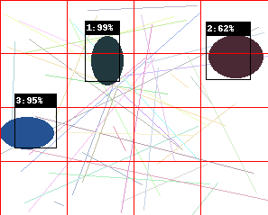
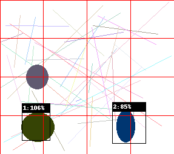
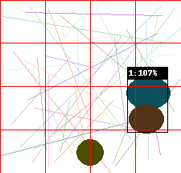
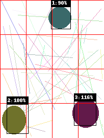

# Aprendizado em desenvolvimento de detecção de objetos

O repositório tem códigos para o desenvolvimento de uma rede neural para detecção de objetos, com intuito de se aproximar do conceito da rede [YOLO](https://pjreddie.com/darknet/yolo/).  

Foram feitas muitas simplificações na teoria, justamente pelo motivo de aprendizado ainda. Dentre elas, destam-se algumas:
- Dataset é fictício, apenas de imagens com círculos, ou seja, dtaset de uma classe;  
- A arquitetura é totalmente diferente da YOLO, já que o dataset é bem mais simples também;  
- A função perda, também pelo fato do problema ser mais simples, também foi simplificada;  

# Resultados

Depois de uma simulação no google colab, pode-se perceber alguns resultados satisfatórios, porém necessitando de ajustes, conforme vemos:  

Nesta primeira imagem podemos ver um bom resultado. As linhas vermelhas são as "grids" que a rede "separa" na imagem. 

  

Já nesta segunda imagem, podemos ver que a rede não conseguiu pegar um objeto além de ter uma confiança de 106% (o que está errado e pode-se usar uma saída sigmoidal para corrigir isso).  

  

Objetos muito próximos também não são detectados por este modelo treinado, conforme vemos:  

  

Um último resultado, detectando todos objetos.  

  

# Conclusões

Embora os resultados estejam distantes do excelente, pode-se aprender um pouco sobre o desenvolvimento de uma rede neural para detecção de objetos utilizando como modelo a rede YOLO, **COM MUITAS SIMPLIFICAÇÕES NESTES CÓDIGOS AQUI**.

# Fontes

- [https://pjreddie.com/darknet/yolo/](https://pjreddie.com/darknet/yolo/)

- Uma playlist muito boa sobre o passo-a-passo para desenvolvimento de detecção de objetos que encontrei no youtube: [https://youtube.com/playlist?list=PLhhyoLH6Ijfw0TpCTVTNk42NN08H6UvNq](https://youtube.com/playlist?list=PLhhyoLH6Ijfw0TpCTVTNk42NN08H6UvNq)
